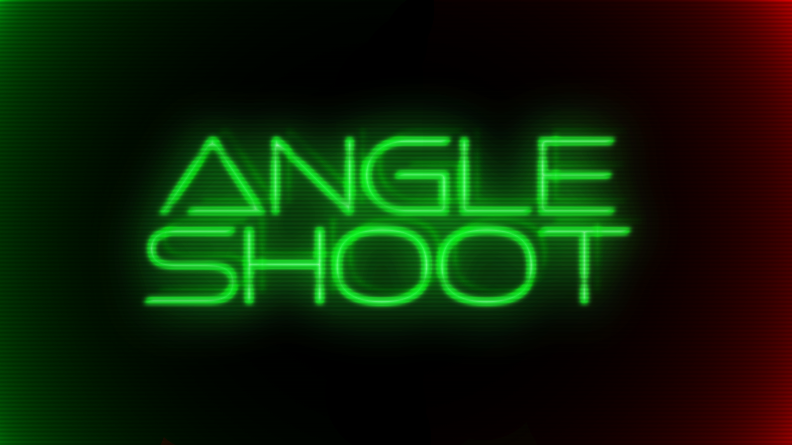
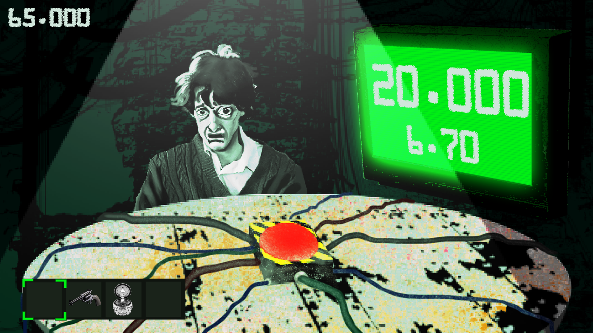

---
# Angle Shoot

Angle shoot is a strategy, puzzle game where you make your life count. You play the chicken game with opponents of five. In order to win, you have to reach the quota while win against your opponent strategically. Trust no one, although you have to trust your gut for them not pressing the red button.

|              |                                               |
| ------------ | ---------------------------------------       |
| Published To | [itch.io](https://cemibon.itch.io/angle-shoot)|
| Made For     | [Brackeys Game Jam 2026.2](https://itch.io/jam/brackeys-16)|
| Status       | Released                                      |
| Platforms    | Windows, MacOS, Web                           |
| Developers   | [Evrenefeb](https://github.com/Evrenefeb), [Cemibon](https://www.instagram.com/limonlu_cemibon/), [Coltiane](https://www.instagram.com/kaanbulart/)                  |
| Genre        | Strategy, Puzzle                              |
| Made with    | Unity Engine                                  |
| Tags         | Singleplayer, 2D, Creepy, Horror, No AI       |
| Content      | No GenAI was used.                            |

---

# 

